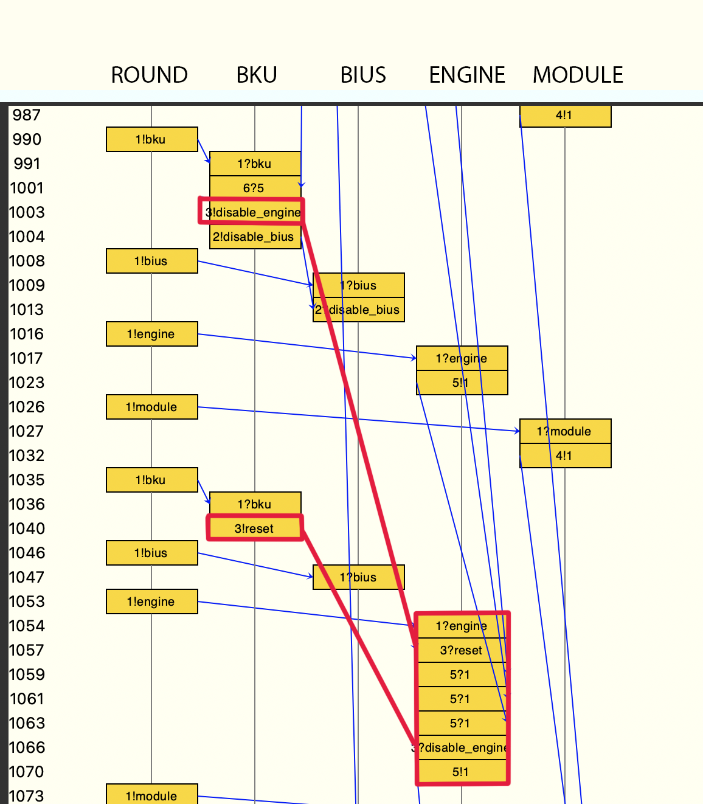
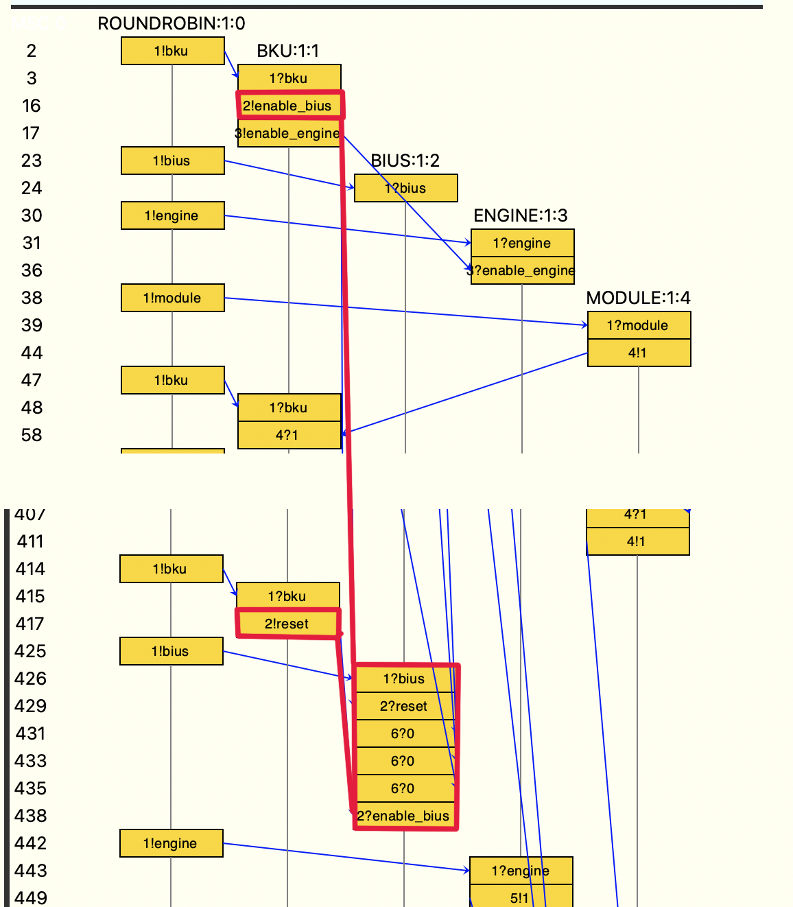

# Задача про Луну-25

## Основные компоненты
- BKU – бортовой комплекс управления. Отдаёт команды, получает данные
- BIUS – блок измерения угловых скоростей. Получает команды { включить, выключить, перезагрузить }, отправляет данные { 0 – если хочет И **выключен**, 1/2/3/4 – если хочет И **включен**} (может не отправлять вообще)
- ENGINE – двигатель корректирует орбиту. Получает команды { включить, выключить }, отправляет текущую мощность {1/2/3/4 – если хочет и включен}
- MODULE – другие модули, отправляют данные когда захотят
- ROUNDROBIN – система коммуникации, по алгоритму round-robin опрашивает все модули. За один опрос модуль может получить одну **единицу данных** ИЛИ отправить **одну команду**.

Модули общаются напрямую друг с другом (без общей шины), но получают и отправляют только по запросу от ROUND.

### Симулируемая катастрофа
> По одной из версий БИУС-Л стал передавать слишком много «нулевых сигналов», перегружая входящий поток данных на БКУ. При такой проблеме БКУ штатно подает БИУС-Л команду «Перезагрузить». При перезагрузке БИУС-Л очистил массив входящих команд и таким образом пропустил команду «Включить акселерометры».

Стоит предположить, что в штатном режиме все модули "не очень активны", то есть, например отправляют данные в среднем раз в 10 раундов. Таким образом BKU успевает их обрабатывать (не более 1 за раунд). По этому на тестовом стенде проблему не обнаружили.

Однако, может случиться ситуация, когда BIUS начнёт отправлять данные КАЖДЫЙ раунд, и совместно с прочими MODULE, BKU будет **получать более одного сообщения**, а **обрабатывать ровно одно**, если "активность" продолжится, то случится переполнение, в результате которого BKU отправляет команду `reset`, которая за счёт более высокого приоритета "обгоняет" команду `включить акселерометры`.

### Исправление симулируемой катастрофы

Есть несколько предложений для исправления:
1. Команда `reset` не должна очищать буффер команд. Это позволит исправить проблему переполнения отправляемых данных, без пропуска команд меньшего приоритета
2. Команда `reset` должна иметь такой же приоритет как и остальные, и выполняться очерёдно
3. BKU за один раунд должен обрабатывать ВСЕ отправленные данные, не приводя к переполнению в принципе (верхний предел входных команд гарантируется round-robin)

Был выбран третий вариант, тк он исправляет причину проблемы, а не её последствия.
Буффер никогда не будет переполнен, а значит `reset` не понадобится выполнять, а значит не будет ситуации в результате которой мы потеряем Команды или Данные, которые тоже могут быть критически важны.

## Решение
Представлены 2 файла:
- main.pml – содержит полную реализацию с ошибкой приводящей к катастрофе
- fixed.pml – содержит исправленную версию

В конце файлов приведены три ltl формулы:
1. `((simulationState == 1) -> F (simulationState == 3 && !isEngineEnabled && !isBiusEnabled))` – Если манёвр начался, то он корректно закончится;

2. `G ((simulationState == 1) -> F (simulationState == 3 && !isEngineEnabled && !isBiusEnabled))` – ВСЕГДА если манёвр начался, то он корректно закончится;

3. `G ((isBiusEnableCommandSend && simulationState == 1) -> F isBiusEnabled)` – Всегда если была отправлена команда на включение BIUS в момент начала маневра, то он когда-нибудь включится.

### Для main.pml
1. Верифицируется корректно. Означает, что был шанс корректно совершить манёвр, и возможно, на тестовом полигоне "везло" и ошибка не была обнаружена
2. Не проходит верифицикацию. Манёвр начинается корректно, однако команда `disable_engine` на выключение двигателей сбрасывается штатной командой `reset`, для предотвращения переполнения буффера данных скорости двигателя.

3. Не проходит верификацию. Демонстрирует описанную выше проблему, команда `enable_bius` была отправлена, однако из-за переполнения канала данных от БИУС `нулями`, отправлена команда `reset`, которая очистила буффер команд вместе с `enable_bius` и БУИС не запустился.



### Для fixed.pml

Верификация всех исходных LTL формул корректно проходят.

### Исправление:
В `BKU` приём сообщений был изменён с приёма *одного пакета данных за раунд*, до приёма *всех доступных пакетов за раунд*

До:

```promela
if
  :: MODULE_DATA ? [module_data] -> { ... };
  :: ENGINE_DATA ? [engine_data] -> { ... };
  :: BIUS_DATA ? [bius_data] -> { ... };
  :: else -> skip;
fi
```

После:

```promela
do
  :: MODULE_DATA ? [module_data] -> { ... };
  :: ENGINE_DATA ? [engine_data] -> { ... };
  :: BIUS_DATA ? [bius_data] -> { ... };
  :: else -> break;
od
```